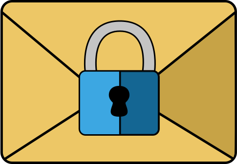

# Encrypted Email Service

This is the email application (created using MEVN stack and cryptico library), that provides the functionality of general email service, such as sending and receiving emails, attach files, set labels, but with better safety.

### Features
- end-to-end encryption
- SPA
- file attachment( < 5MB)
- 2 roles user and admin(can see other users and change their role)
- view chat story
- cloudinary for user account photo
- jwt tokens as authorization system

### API 
Using API you should realize encryption with cryptico library. There is API documentation on this site on about page.

### Setup
Use `npm install` to install all the dependencies and `npm start` to run the server. Then go to client/ folder and setup client side accordingly to the local README.

### Todos 
(for your hosting)
 - If receiver is not from your service, create plain(with no encryption) version of letter and send it to the server, where you need to realize sending to another service
 - When receiving letter from another service, redirect this request to the post 
